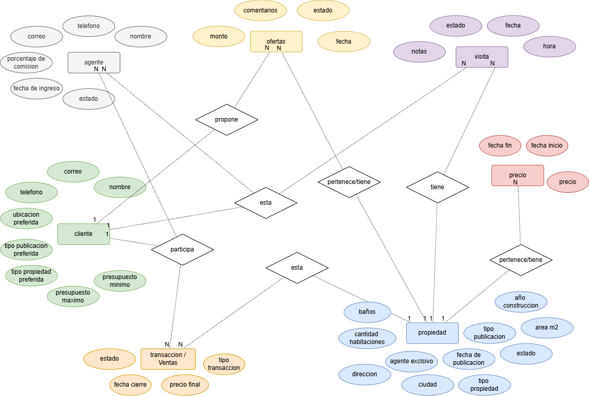
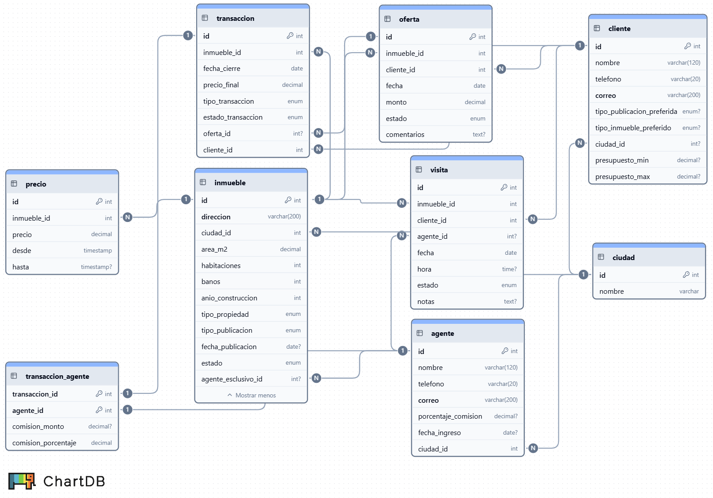
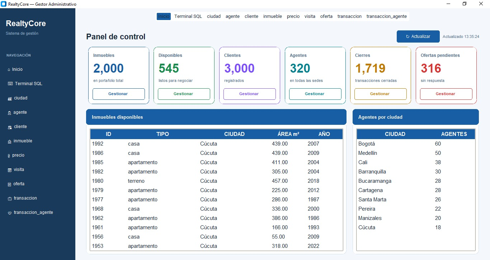
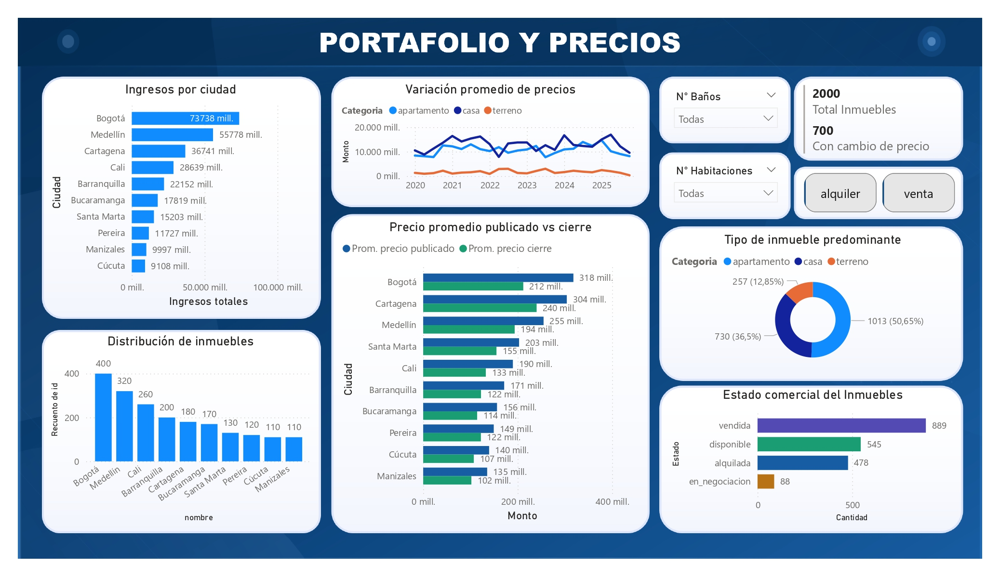
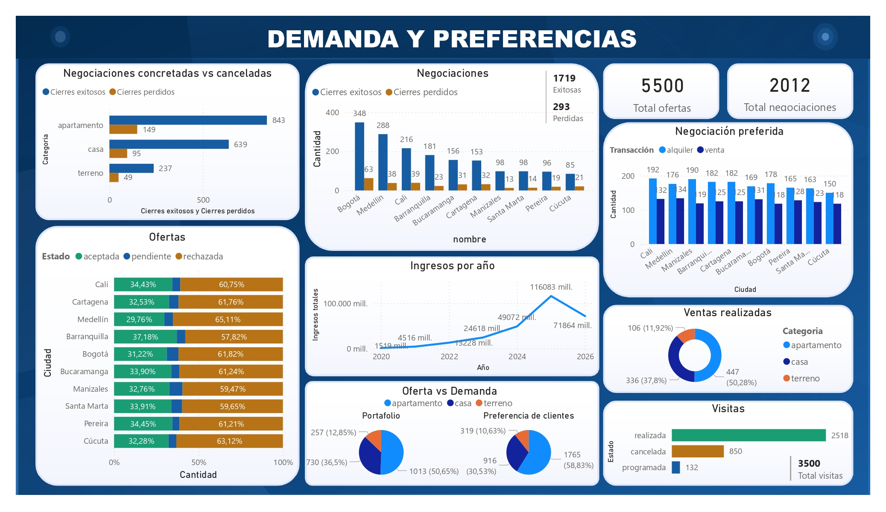

# RealtyFlow — Sistema de gestión y análisis de datos para inmobiliarias


## BeTek | Análisis de Datos – Cohorte 13
### Proyecto Final: RealtyFlow
> Sistema de base de datos relacional diseñado para centralizar y estructurar la información operativa de una inmobiliaria, habilitando el análisis estratégico mediante consultas SQL y visualización en Power BI.

---

## Tabla de contenidos

1. [Descripción del problema](#descripción-del-problema)
2. [Objetivos](#objetivos)
3. [Alcance](#alcance)
4. [Modelo entidad–relación](#modelo-entidadrelación)
5. [Modelo relacional](#modelo-relacional)
6. [Implementación SQL](#implementación-sql)
7. [Generación de datos — RealtyCore](#generación-de-datos--realtycore)
8. [Reglas de coherencia de datos](#reglas-de-coherencia-de-datos)
9. [Preguntas de negocio](#preguntas-de-negocio)
10. [Consultas SQL](#consultas-sql)
11. [Dashboard en Power BI](#dashboard-en-power-bi)
12. [Hallazgos principales](#hallazgos-principales)
13. [Conclusiones](#conclusiones)
14. [Recomendaciones y trabajo futuro](#recomendaciones-y-trabajo-futuro)
15. [Equipo](#equipo)
16. [Anexos](#anexos)

---

## Descripción del problema

Las inmobiliarias gestionan simultáneamente múltiples inmuebles en venta y alquiler, agentes responsables, clientes interesados, visitas programadas, ofertas recibidas y transacciones cerradas. Cuando esta información no se encuentra centralizada, se presentan los siguientes problemas:

- Dificultad para controlar la disponibilidad real de los inmuebles.
- Falta de seguimiento estructurado de ofertas y su conversión en cierres.
- Ausencia de historial de cambios de precio.
- Problemas en el cálculo y distribución de comisiones.
- Poca capacidad para analizar tendencias del mercado.
- Toma de decisiones basada en información incompleta o desactualizada.

Esta situación limita la eficiencia operativa y reduce la capacidad estratégica de la inmobiliaria. RealtyFlow resuelve este problema mediante una base de datos relacional que organiza la información, mantiene su integridad y facilita su análisis posterior.

---

## Objetivos

### Objetivo general

Diseñar e implementar una base de datos relacional que permita gestionar integralmente la información de una inmobiliaria y facilitar el análisis de datos mediante consultas SQL y visualización en Power BI.

### Objetivos específicos

- Desarrollar el modelo conceptual (diagrama ER) y lógico (modelo relacional), materializándolo en un sistema de gestión con tablas y datos representativos generados con IA.
- Formular y ejecutar consultas SQL que respondan preguntas estratégicas de negocio y generen insights operativos.
- Conectar la base de datos a Power BI para construir un dashboard interactivo con los resultados.

---

## Alcance

El sistema RealtyFlow cubre:

- Gestión de inmuebles en venta y alquiler en 10 ciudades colombianas.
- Gestión de agentes inmobiliarios por sede y sus comisiones.
- Gestión de clientes y preferencias de búsqueda.
- Registro y control de visitas programadas, realizadas y canceladas.
- Registro de ofertas y su estado (pendiente, aceptada, rechazada).
- Registro de transacciones finalizadas (venta o alquiler), vinculadas a una oferta aceptada.
- Historial de precios de los inmuebles.
- Análisis y visualización estratégica en Power BI.

---

## Modelo entidad–relación



Las principales entidades del sistema son:

| Entidad | Descripción |
|---|---|
| `agente` | Personal inmobiliario que gestiona inmuebles y recibe comisiones por sede |
| `cliente` | Usuarios interesados en inmuebles, con preferencias de búsqueda registradas |
| `inmueble` | Inmuebles con detalle, estado y tipo de publicación |
| `precio` | Historial de cambios de precio de cada inmueble |
| `visita` | Registros de visitas a un inmueble con estado y notas |
| `oferta` | Propuestas económicas de clientes sobre un inmueble |
| `transaccion` | Cierre de venta o alquiler, siempre vinculado a una oferta aceptada |

### Relaciones principales

- Un agente pertenece a una sede (ciudad) y puede gestionar múltiples inmuebles de esa ciudad.
- Un cliente puede realizar múltiples ofertas sobre distintas inmuebles.
- Una inmueble puede recibir múltiples visitas y múltiples ofertas, pero solo puede tener **una transacción de venta cerrada** (una inmueble se vende una sola vez).
- Una inmueble de alquiler puede tener múltiples transacciones cerradas a lo largo del tiempo (contratos sucesivos).
- Toda transacción cerrada o cancelada está obligatoriamente vinculada a una oferta aceptada mediante `oferta_id`.
- Una transacción puede generar comisiones para uno o más agentes.

---

## Modelo relacional



### Tablas y atributos clave

```
ciudad (id, nombre)
agente (id, nombre, correo, telefono, porcentaje_comision, fecha_ingreso, ciudad_id)
cliente (id, nombre, correo, telefono, tipo_publicacion_preferida, tipo_inmueble_preferido, ciudad_id, presupuesto_min, presupuesto_max)
inmueble (id, tipo_publicacion, tipo_inmueble, direccion, ciudad_id, area_m2, habitaciones, banos, anio_construccion, estado, fecha_publicacion, agente_exclusivo_id)
precio(id, inmueble_id, precio, desde, hasta)
visita (id, inmueble_id, cliente_id, agente_id, fecha, hora, estado, notas)
oferta (id, inmueble_id, cliente_id, fecha, monto, estado, comentarios)
transaccion id, inmueble_id, cliente_id, fecha_cierre, precio_final, tipo_transaccion, estado_transaccion, oferta_id)
transaccion_agente (transaccion_id, agente_id, comision_monto, comision_porcentaje)
```

### Restricciones ENUM

| Tabla | Atributo | Valores permitidos |
|---|---|---|
| `cliente` | `tipo_publicacion_preferida` | `'venta'`, `'alquiler'` |
| `cliente` | `tipo_inmueble_preferido` | `'casa'`, `'apartamento'`, `'terreno'` |
| `inmueble` | `tipo_publicacion` | `'venta'`, `'alquiler'` |
| `inmueble` | `tipo_inmueble` | `'casa'`, `'apartamento'`, `'terreno'` |
| `inmueble` | `estado` | `'disponible'`, `'en_negociacion'`, `'vendida'`, `'alquilada'` |
| `visita` | `estado` | `'programada'`, `'realizada'`, `'cancelada'` |
| `oferta` | `estado` | `'pendiente'`, `'aceptada'`, `'rechazada'` |
| `transaccion` | `tipo_transaccion` | `'venta'`, `'alquiler'` |
| `transaccion` | `estado_transaccion` | `'cerrada'`, `'cancelada'` |

---

## Implementación SQL

El script `realtyflow_db.sql` contiene:

**DDL — Definición de estructura:**
- Creación de tablas con claves primarias auto-incrementales.
- Definición de claves foráneas con acciones `ON DELETE CASCADE` y `ON DELETE SET NULL` según corresponda.
- Restricciones `CHECK` para campos numéricos (precios, comisiones, áreas).
- Restricciones `UNIQUE` para combinaciones que no deben repetirse.

**DML — Datos de prueba:**
- 10 ciudades 
- 320 agentes distribuidos en 10 ciudades.
- 3,000 clientes con preferencias de búsqueda.
- 2,000 inmuebles con precios coherentes por ciudad y tipo.
- 2,700 registros de precio (35% con historial de cambio).
- 3,500 visitas con estado coherente respecto a la fecha.
- 5,500 ofertas donde toda oferta aceptada genera exactamente una transacción.
- 2,012 transacciones.
- 2,403 registros de comisión en `transaccion_agente`.

---

## Generación de datos — RealtyCore

Los datos de prueba fueron generados con asistencia de IA simulando un entorno real, calibrado con proporciones del mercado inmobiliario colombiano. Adicional se creo **RealtyCore**, un sistema desarrollado en Python que se encarga de crear, validar y administrar todos los registros de la base de datos de forma eficiente y escalable, garantizando que cada dato cumpla con las reglas de coherencia del negocio antes de ser insertado.



---

## Preguntas de negocio

Las siguientes preguntas guiaron el diseño de las consultas y el dashboard:

- ¿Cuántas inmuebles disponibles existen por ciudad?
- ¿Cuál es el precio promedio por ciudad?
<!-- 3. ¿Cuáles inmuebles reciben más visitas y qué porcentaje se convierte en transacción? -->
- ¿Qué porcentaje de ofertas son aceptadas, rechazadas y pendientes?
- ¿Qué ciudades tienen mayor volumen de transacciones finalizadas?
<!-- 6. ¿Qué rango de precios concentra la mayor cantidad de ofertas? -->
<!-- 7. ¿Qué tipo de inmueble tiene mayor demanda según visitas y ofertas? -->
<!-- 8. ¿Cuál es el agente con mayor volumen de ventas? -->
- ¿Cuántas inmuebles se encuentran disponibles actualmente?
- ¿Qué tipo de inmueble se vende con mayor frecuencia?
<!-- 11. ¿Cuál es el precio promedio por tipo de inmueble? -->
<!-- 12. ¿Cuántas ofertas recibe en promedio cada inmueble? -->
- ¿Qué ciudad presenta mayor volumen de transacciones?
<!-- 14. ¿Qué agentes han cerrado más transacciones y cuánto han generado en comisiones? -->
<!-- 15. ¿Cuánto tarda en promedio una inmueble en venderse desde su publicación? -->
<!-- 16. ¿Qué inmuebles reciben más visitas y cuál es la tasa de conversión? -->
- ¿Qué ciudades tienen el precio promedio más alto?
<!-- 18. ¿Qué porcentaje de inmuebles publicadas termina en transacción exitosa? -->
<!-- 19. ¿Cuál es el tiempo promedio que tarda cada agente en cerrar una venta? -->
<!-- 20. ¿Qué inmuebles llevan más tiempo disponibles sin recibir ofertas? -->
<!-- 21. ¿Existe relación entre el precio de una inmueble y la cantidad de visitas que recibe? -->

---

## Consultas SQL

El script `realtyflow_queries.sql` contiene las consultas. Las técnicas utilizadas incluyen:

- `JOIN`, `LEFT JOIN` para cruzar tablas con y sin registros relacionados.
- `GROUP BY` y `HAVING` para agrupaciones con filtros sobre agregados.
- Funciones de agregación: `COUNT`, `SUM`, `AVG`, `MIN`, `MAX`.
- `CASE` para rangos de precio y lógica condicional.
- `WITH` (CTEs) para consultas en múltiples pasos.
- `NULLIF` para evitar división por cero.
- `COALESCE` para manejar valores nulos en LEFT JOINs.
- `DATEDIFF` para cálculo de tiempos entre fechas.
- `RANK() OVER` para funciones de ventana.
- Subconsultas como fuente en el `FROM`.

> El script completo se incluye en los anexos.

---

## Dashboard en Power BI

La base de datos fue conectada a Power BI para construir un dashboard interactivo.

### Página 1 — Datos generales


- KPIs: total inmuebles, transacciones, agentes, ingresos totales, ciudades con cobertura, ofertas y visitas.

### Página 2 — Portafolio


- Distribución por ciudad y por tipo de inmueble.
- Estado del portafolio (disponible / en negociación / vendida / alquilada).
- Evolución histórica de precios publicados.
- Precio promedio publicado vs precio de cierre.
- Ingresos transaccionados por ciudad.

### Página 3 — Demanda y Preferencias
 

- oferta vs Demanda.
- Estado de ofertas por ciudad.
- Estado de visitas.
- Cierres vs transacciones canceladas por ciudad.
<!--
<!-- ### Página 3 — Financiero y comportamiento del cliente -->

<!-- IMAGEN PÁGINA 3 POWER BI -->
<!-- 

- GAP % entre precio publicado y precio de cierre por ciudad.
- Mapa de calor: ticket promedio por ciudad × tipo de inmueble.
- Valor transaccionado y ticket promedio año a año.
- Brecha entre presupuesto del cliente y precio del mercado.
- Preferencias del cliente vs oferta del portafolio (donut doble).
- Clientes registrados que nunca han cerrado un negocio + potencial sin activar. -->

### Filtros (segmentadores)

- Ciudad
- Numero de baños y habitaciones
- Tipo de inmueble
- Tipo de transacción
<!-- - Rango de fechas (visitas y transacciones) -->

<!-- ---

## Hallazgos principales

### Hallazgo 1 — El embudo se rompe al inicio, no al final

De 3,500 visitas agendadas, el 38% nunca se realizó (1,329 visitas canceladas o no concretadas). Sin embargo, una vez que la visita se realiza y se genera una oferta, el proceso de cierre es sólido: de cada 10 ofertas aceptadas, más de 8 terminan en transacción cerrada. El cuello de botella está en la etapa más temprana del proceso, no en la negociación.

**Recomendación:** implementar seguimiento activo previo a cada visita (confirmación 24 horas antes, verificación de interés del cliente) para recuperar parte de ese 38%.

### Hallazgo 2 — Los agentes cierran ligeramente por encima del precio publicado en todas las ciudades

Comparando el precio publicado al momento del cierre con el precio final de transacción, en todas las ciudades el precio de cierre supera al publicado entre un 0.5% y un 2.4%. Medellín lidera con +2.4%, mientras Pereira y Manizales están en +0.5%. Esto indica que los agentes tienen un margen positivo de negociación, y que los precios de publicación podrían ajustarse al alza progresivamente sin perder demanda. -->

---

## Conclusiones

RealtyFlow demuestra que centralizar la información de una inmobiliaria en una base de datos relacional no solo resuelve un problema operativo, sino que habilita una capacidad analítica que antes no existía. Las consultas SQL y el dashboard en Power BI permiten identificar en tiempo real qué agentes están convirtiendo, qué ciudades están bajo rendimiento, dónde se caen las oportunidades y cuánto potencial comercial hay en la cartera actual sin explotar.

El proyecto evidencia que el diseño adecuado de la base de datos — con reglas de coherencia explícitas entre tipos de publicación, estados, transacciones y precios — es el fundamento indispensable para que cualquier análisis posterior sea confiable.

---

## Recomendaciones y trabajo futuro

- Implementar gestión de usuarios y roles (administrador, agente, supervisor) mediante aplicación web conectada a la base de datos.
- Añadir análisis geográfico de inmuebles con visualización en mapa.
- Automatizar reportes periódicos para gerencia.
- Incorporar modelos predictivos para estimación de precios y probabilidad de cierre.
- Escalar el sistema a múltiples sucursales con datos reales.
- Integrar alertas automáticas para ofertas pendientes próximas a vencer los 90 días.

---

## Equipo


---

## Anexos

| Archivo | Descripción |
|---|---|
| `realtyflow_db.sql` | Script DDL + DML — estructura y datos completos |
| `realtyflow_queries.sql` | consultas SQL sobre preguntas de negocio |
| `realtyflow_dashboard.pbix` | Dashboard Power BI |
| `realtyflow_dashboard.pdf` | PDF con el dashboard de Power BI |